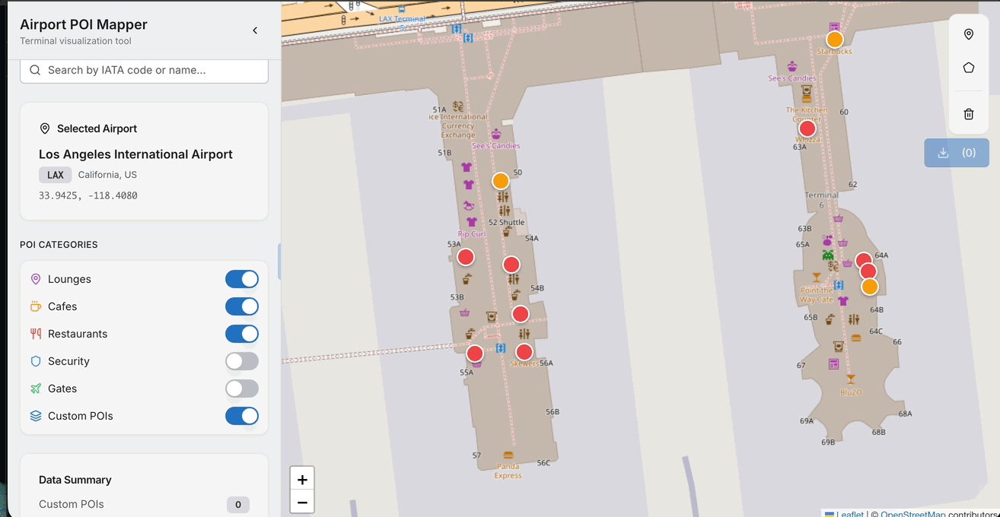
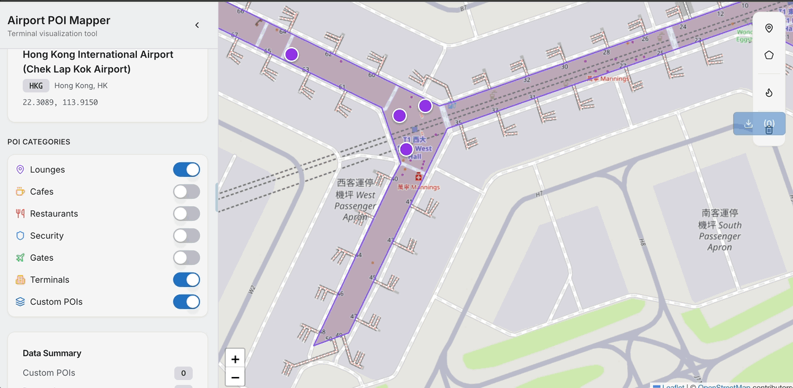

# Airport Terminal POI Mapping Application

## Overview
An interactive web application for visualizing and editing points of interest (POIs) in airport terminals worldwide. Built with React, Leaflet, and OpenStreetMap data.




## Purpose
This application allows users to:
- Search and navigate to airports by IATA code or name
- View existing POIs (lounges, cafes, restaurants, security checkpoints, gates) from OpenStreetMap
- Add custom POI markers and draw polygon areas to define terminal zones
- Export all data as GeoJSON for external use


## Additional visualisation functionality

Terminal gate heatmp based on scheduled flight seat volumes by the scheduled departure gate (from OAG)



For further info, see confluence page
https://lifestyle-x-wiki.atlassian.net/wiki/x/AoDGYQ


## How to run the app locally

Here's how you can run and test this airport POI mapping app locally on your machine:

I) Prerequisites

How to install npm and Node.js to your machine, see https://nodejs.org/en/download/

- Node.js (v18 or v20 recommended)
- npm package manager

II) Clone or Download the Project
Download all the project files to a local directory on your computer.

III) Install Dependencies

Open terminal console and run the following command to intall the required packages

```npm install```

IV) Start the Development Server

```npm run dev```
or 
```NODE_TLS_REJECT_UNAUTHORIZED=0 npm run dev``` 

> [!NOTE]
> One may need to add `NODE_TLS_REJECT_UNAUTHORIZED=0` as well in order to bypass the certification verification step when querying the OpenStreet Map data via the API

This single command starts both:

Backend: Express server on port 5000
Frontend: Vite development server (served through the same port)

V) Access the Application
Open your browser and navigate to:

http://localhost:5000


## Architecture

### Frontend
- **Framework**: React with TypeScript
- **Map Library**: Leaflet with React-Leaflet integration
- **Drawing Tools**: Leaflet Draw for polygon and marker placement
- **UI Components**: Shadcn UI with Tailwind CSS
- **State Management**: React Query for server state, localStorage for persistence
- **Routing**: Wouter

### Backend
- **Server**: Express.js
- **Storage**: In-memory storage (MemStorage)
- **External API**: OpenStreetMap Overpass API for fetching POI data
- **Data Models**: Airports, Custom POIs, Drawn Polygons

## Key Features

### 1. Airport Selection
- Searchable sidebar with IATA code and airport name autocomplete
- Pre-seeded with 10 major international airports (JFK, LHR, HKG, DXB, SIN, LAX, CDG, NRT, SFO, AMS)
- Selected airport displays coordinates and zooms map to terminal area

### 2. POI Visualization
- Fetches real-time POI data from OpenStreetMap Overpass API
- Categorized markers with color coding:
  - Purple: Lounges
  - Amber: Cafes
  - Red: Restaurants
  - Blue: Security checkpoints
  - Green: Gates
- Toggle filters to show/hide specific POI categories

### 3. Drawing Tools
- **Add Marker**: Click on map to place custom POI with metadata (name, category, description)
- **Draw Polygon**: Click to add points, double-click to complete polygon area
- Automatic area calculation in square meters
- Delete individual features via popups

### 4. Data Export
- Export as GeoJSON or JSON format
- Selectively include custom POIs and/or drawn polygons
- File naming includes airport IATA code

### 5. Data Persistence
- localStorage automatically saves custom POIs and drawn polygons
- Data persists across sessions

## Project Structure

```
├── client/
│   └── src/
│       ├── pages/
│       │   ├── map.tsx                    # Main map page
│       │   └── components/
│       │       ├── MapContainer.tsx       # Leaflet map with drawing tools
│       │       ├── AirportSidebar.tsx     # Collapsible sidebar with search
│       │       ├── DrawingToolsPanel.tsx  # Floating toolbar for drawing
│       │       ├── ExportPanel.tsx        # Data export controls
│       │       ├── CustomPoiModal.tsx     # Modal for adding custom POIs
│       │       └── PolygonModal.tsx       # Modal for defining polygon areas
│       └── App.tsx                        # App router
├── server/
│   ├── routes.ts                          # API endpoints
│   └── storage.ts                         # In-memory storage implementation
└── shared/
    └── schema.ts                          # Shared TypeScript types and schemas
```

## API Endpoints

- `GET /api/airports` - Get all airports
- `GET /api/airports/:iataCode` - Get airport by IATA code
- `GET /api/pois/:airportId` - Fetch POIs from OpenStreetMap for an airport
- `GET /api/custom-pois/:airportId` - Get custom POIs for an airport
- `POST /api/custom-pois` - Create a custom POI
- `DELETE /api/custom-pois/:id` - Delete a custom POI
- `GET /api/polygons/:airportId` - Get drawn polygons for an airport
- `POST /api/polygons` - Create a drawn polygon
- `DELETE /api/polygons/:id` - Delete a drawn polygon

## Design System
Follows minimalist, map-first design principles:
- Clean, unobtrusive UI with floating panels
- Consistent spacing (4, 6, 8px units)
- Typography: Inter font family
- Color-coded POI categories for quick identification
- Responsive layout with collapsible sidebar

## Recent Changes
- Initial implementation complete (October 31, 2025)
- All core MVP features implemented:
  - Airport search and selection
  - OpenStreetMap POI integration
  - Custom marker and polygon drawing tools
  - GeoJSON export functionality
  - localStorage persistence

## Technical Notes

### Leaflet Integration
- Custom icon fix applied for default markers
- Drawing mode indicators show active tool and instructions
- Popup-based feature editing with delete functionality
- Automatic map centering on airport selection

### OpenStreetMap Integration
- Uses Overpass API with 2km radius around airport coordinates
- Queries for cafes, restaurants, lounges, gates, and information points
- Graceful fallback if API is unavailable

### Data Models
- Airports: IATA code, name, city, country, coordinates
- Custom POIs: Name, category, description, coordinates
- Drawn Polygons: Name, zone type, notes, coordinates array, calculated area

## Future Enhancements
- Database integration for permanent storage
- Import functionality for previously exported GeoJSON
- Multi-airport project management
- Advanced filtering and search
- Measurement tools for distances
- User authentication and sharing
